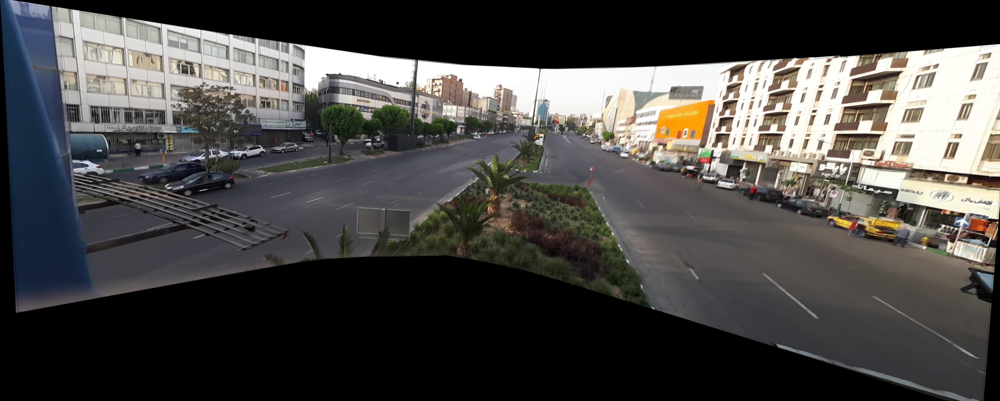

In this project, we attempted to make a panorama from the background of the video by calculating Homography between the center frame of the video and other video frames with SIFT and RANSAC and, in the end, remove moving objects in the video.

The unput video is taken from one of the tehran streets with only rotational video , the original video was 100MB but for make it easier to upload we compress it to almost 15MB

At the end we have a panorama from a background of the video and a output video with no moving objects in it.

the estimated time for running is 2 hours.

**input  Video:**

**The results:**

backgroung panorama:

backgroung video:

